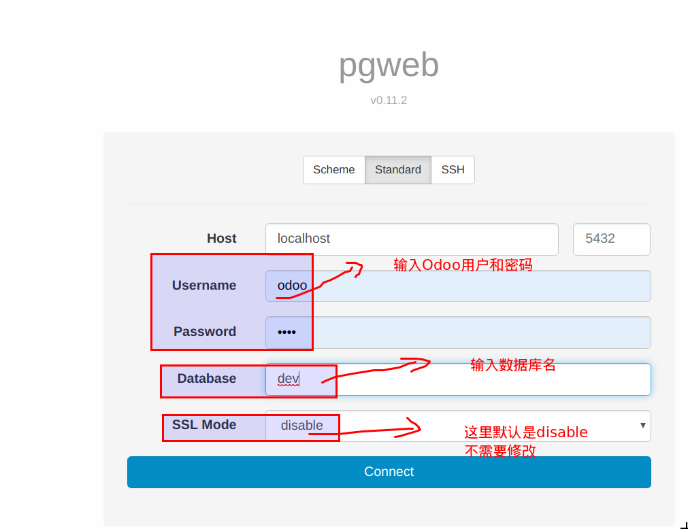

# Pgweb

```
postgres 修改用户密码步骤：

[root@laptop ~]# su - postgres
[postgres@laptop ~]$ psql
psql (10.7)
Type "help" for help.

postgres=# alter user odoo with password 'odoo';
ALTER ROLE


查看当前用户：
postgres=# \du
List of roles
Role name | Attributes | Member of
-----------+------------------------------------------------------------+-----------
odoo | Superuser, Create role, Create DB | {}
postgres | Superuser, Create role, Create DB, Replication, Bypass RLS | {}


===================================================================

pgweb使用

1.下载pgweb_linux

2.使用odoo用户，如果没有新建：

postgres=# create user odoo createdb createrole login password 'odoo';
CREATE ROLE

3.修改配置文件：
使用root用户进行修改

[root@laptop data]# locate pg_hba.conf   #找到pg配置文件的路径
/usr/pgsql-10/share/pg_hba.conf.sample
/usr/share/pgsql/pg_hba.conf.sample
/var/lib/pgsql/data/pg_hba.conf


[root@laptop data]# vi /var/lib/pgsql/data/pg_hba.conf
```


```
这里使用md5认证方式
增加这两行红色内容： 然后保存


备注：
这里要搞清楚这些method的意思以及什么情况下用什么method：

1)trust
无条件地允许连接。这种方法允许任何可以与PostgreSQL数据库服务器连接的用户以他们期望的任意PostgreSQL数据库用户身份登入，而不需要口令或者其他任何认证。

2)reject
无条件地拒绝连接。这有助于从一个组中”过滤出”特定主机，例如一个reject行可以阻塞一个特定的主机连接，而后面一行允许一个特定网络中的其余主机进行连接。

3)md5
要求客户端提供一个双重 MD5 加密的口令进行认证。

4)password
要求客户端提供一个未加密的口令进行认证。因为口令是以明文形式在网络上发送的，所以我们不应该在不可信的网络上使用这种方式。

5)gss
用 GSSAPI 认证用户。只对TCP/IP 连接可用。

6)sspi
用 SSPI 来认证用户。只在Windows 上可用。

7)ident
通过联系客户端的 ident 服务器获取客户端的操作系统名，并且检查它是否匹配被请求的数据库用户名。Ident 认证只能在 TCIP/IP 连接上使用。当为本地连接指定这种认证方式时，将用 peer 认证来替代。

8)peer
从操作系统获得客户端的操作系统用户，并且检查它是否匹配被请求的数据库用户名。这只对本地连接可用。

9)ldap
使用LDAP服务器认证。

10)radius
用 RADIUS 服务器认证。

11)cert
使用 SSL 客户端证书认证。

12)pam
使用操作系统提供的可插入认证模块服务（PAM）认证。

13)bsd
使用由操作系统提供的 BSD 认证服务进行认证。


4.重启postgres服务
[root@laptop data]# systemctl restart postgresql.service


5.普通用户执行下面命令：


[jian@laptop bin]$ ./pgweb_linux --user=odoo --pass=odoo
Pgweb v0.11.2 (git: d3aaf8f5dbe5032734aeaea9c44eb79ef61eeaec)
Connecting to server...
Error: pq: database "odoo" does not exist
Starting server...
To view database open http://localhost:8081/ in browser


6.浏览器打开下面地址：

http://localhost:8081/   进行相关配置就可以了
```

